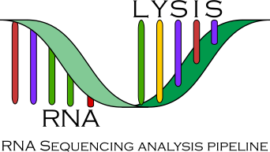

.. RNAlysis documentation master file, created by
   sphinx-quickstart on Thu Jul  4 20:06:55 2019.
   You can adapt this file completely to your liking, but it should at least
   contain the root `toctree` directive.

RNAlysis |release| documentation
===================================

.. |pipimage| image:: https://img.shields.io/pypi/v/rnalysis.svg
        :target: https://pypi.python.org/pypi/rnalysis

**Useful links:** `Current version <https://pypi.python.org/pypi/rnalysis>`_ |pipimage| | `Documentation <https://guyteichman.github.io/RNAlysis>`_ | `Source code <https://github.com/GuyTeichman/RNAlysis>`_ | `Bug reports <https://github.com/GuyTeichman/RNAlysis/issues>`_

----

.. toctree::
   :maxdepth: 2
   :caption: About RNAlysis:

   What is RNAlysis? <readme>
   GitHub page <https://github.com/GuyTeichman/RNAlysis>
   authors

.. toctree::
   :maxdepth: 2
   :caption: Starting with RNAlysis:

   installation
   user_guide
   glossary

.. toctree::
   :maxdepth: 2
   :caption: Change history:

   history

Modules:
---------
.. autosummary::
  :toctree:
  :caption: Modules:

  rnalysis.filtering
  rnalysis.enrichment
  rnalysis.general

Indices and tables:
-------------------
* :ref:`genindex`
* :ref:`modindex`
