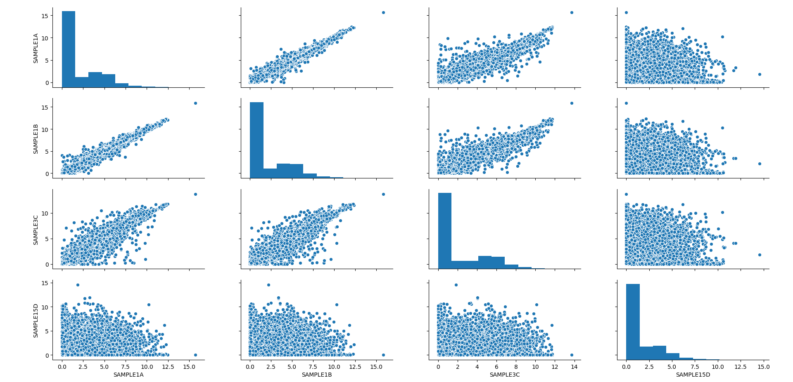

############################
RNAlysis user guide
############################

****************************
RNAlysis filtering module
****************************
RNAlysis's filtering module (rnalysis.filtering) is built to allow rapid and easy to understand filtering of various forms of RNA sequencing data. The module also contains specific methods for visualization and clustering of data.

The filtering module is built around Filter objects, which are containers for tabular sequencing data. You can use the different types of Filter objects to apply filtering operations to various types of tabular data. You will learn more about Filter objects in the next section.

Working with Filter objects
============================

All Filter objects (DESeqFilter, CountFilter, FoldChangeFilter) work on the same principles,
and share many of the same functions and features. Each of them also has specific filtering, analysis and visualisation functions. In this section we will look into the general usage of Filter objects.

Initialize a Filter object
--------------------------

We will start by importing the filtering module::

    >>> from rnalysis import filtering

We can now, for example, create a DESeqFilter object from a DESeq2 csv output file (see more details about DESeqFilter in sections below).
::

    >>> d = filtering.DESeqFilter("tests/test_deseq.csv")

View a Filter object
--------------------

In order to view a glimpse of the file we imported we can use the 'head' and 'tail' functions.
By default 'head' will show the first 5 rows of the file, and 'tail' will show the last 5 rows,
but you can specify a specific number of lines to show.
::

    >>> d.head()
                   baseMean  log2FoldChange  ...         pvalue           padj
    WBGene00000002  6820.755327        7.567762  ...   0.000000e+00   0.000000e+00
    WBGene00000003  3049.625670        9.138071  ...  4.660000e-302  4.280000e-298
    WBGene00000004  1432.911791        8.111737  ...  6.400000e-237  3.920000e-233
    WBGene00000005  4028.154186        6.534112  ...  1.700000e-228  7.800000e-225
    WBGene00000006  1230.585240        7.157428  ...  2.070000e-216  7.590000e-213

    [5 rows x 6 columns]
    >>> d.tail(8)
                   baseMean  log2FoldChange  ...         pvalue           padj
    WBGene00000022   365.813048        6.101303  ...  2.740000e-97  2.400000e-94
    WBGene00000023  3168.566714        3.906719  ...  1.600000e-93  1.340000e-90
    WBGene00000024   221.925724        4.801676  ...  1.230000e-84  9.820000e-82
    WBGene00000025  2236.185837        2.477374  ...  1.910000e-81  1.460000e-78
    WBGene00000026   343.648987       -4.037191  ...  2.320000e-75  1.700000e-72
    WBGene00000027   175.142856        6.352044  ...  1.580000e-74  1.120000e-71
    WBGene00000028   219.163200        3.913657  ...  3.420000e-72  2.320000e-69
    WBGene00000029  1066.242402       -2.811281  ...  1.420000e-70  9.290000e-68

    [8 rows x 6 columns]

We can also see the total number of rows and columns by accessing the 'shape' attribute::

    >>> d.shape
    (28, 6)

meaning there are 28 rows and 6 columns in the file.

Filtering operations
--------------------

Now we can start filtering the entries in the file according to parameters of our choosing.
Various filtering operations are applied directly to the Filter object. Those operations do not affect the original csv file, but its representation within the Filter object.
For example, we can the function 'filter_percentile' to remove all rows that are above the specified percentile (in our example, 75% percentile) in the specified column (in our example, 'log2FoldChange')::

    >>> d.filter_percentile(0.75,'log2FoldChange')
    Filtered 7 features, leaving 21 of the original 28 features. Filtered inplace.

If we now look at the shape of d, we will see that 5954 rows have been filtered out of the object, and we remain with 17781 rows.
::

    >>> d.shape
    (21, 6)

By default, filtering operations on Filter objects are performed in-place, meaning the original object is modified. However, we can save the results into a new Filter object and leave the current object unaffected by passing the argument 'inplace=False' to any filtering function within RNAlysis. For example::

    >>> d = filtering.DESeqFilter("tests/test_deseq.csv")
    >>> d.shape
    (28, 6)
    >>> d_filtered = d.filter_percentile(0.75,'log2FoldChange',inplace=False)
    Filtered 7 features, leaving 21 of the original 28 features. Filtering result saved to new object.
    >>> d_filtered.shape
    (21, 6)
    >>> d.shape
    (28, 6)

In this case, the object 'd' remained unchanged, while 'd_filtered' became a new Filter object which contains our filtered results. We can continue applying filters sequentially to the same Filter object, or using 'inplace=False' to create a new object at any point.

Another useful option is to perform an opposite filter. When we specify the parameter 'opposite=True' to any filtering function within RNAlysis, the filtering function will be performed in opposite. This means that all of the genomic features that were supposed to be filtered out are kept in the object, and the genomic features that were supposed to be kept in the object are filtered out.
For example, if we now wanted to remove the rows which are below the 25% percentile in the 'log2FoldChange' column, we will use the following code::

    >>> d.filter_percentile(0.25,'log2FoldChange',opposite=True)
    Filtered 7 features, leaving 21 of the original 28 features. Filtered inplace.

Calling this function without the 'opposite' parameter would have removed all values except the bottom 25% of the 'log2FoldChange' column. When specifying 'opposite', we instead throw out the bottom 25% of the 'log2FoldChange' column and keep the rest.

There are many different filtering functions within the filtering module. Some of them are subtype-specific (such as 'filter_low_reads' for CountFilter objects and 'filter_significant' for DESeqFilter objects), while others can be applied to any Filter object. You can read more about the different functions and their usage in the project's documentation.

Performing set operations on multiple Filter objects
----------------------------------------------------

In addition to using regular filters, it is also possible to use set operations such as union, intersection, difference and symmetric difference to combine the results of multiple Filter objects. Those set operations can be applied to any Filter object, as well as to python sets. The objects don't have to be of the same subtype - you can, for example, look at the union of a DESeqFilter object, an CountFilter object and a python set::

    >>> d = filtering.DESeqFilter("tests/test_deseq.csv")
    >>> counts = filtering.CountFilter('tests/counted.csv')
    >>> a_set = {'WBGene00000001','WBGene00000002','WBGene00000003'}
    >>> d.difference(counts, a_set)
    {'WBGene00007063', 'WBGene00007064', 'WBGene00007066', 'WBGene00007067', 'WBGene00007069', 'WBGene00007071',
     'WBGene00007074', 'WBGene00007075', 'WBGene00007076', 'WBGene00007077', 'WBGene00007078', 'WBGene00007079',
     'WBGene00014997', 'WBGene00043987', 'WBGene00043988', 'WBGene00043989', 'WBGene00043990', 'WBGene00044022',
     'WBGene00044951', 'WBGene00077502', 'WBGene00077503', 'WBGene00077504'}

When performing set operations, the return type can be either a python set (default) or a string. This means you can use the output of the set operation as an input for yet another set operation. However, since the returned object is a set you cannot use Filter object functions such as 'head' and 'save_csv' on it, or apply filters to it directly. Intersection and Difference in particular can be used in-place, which applies the filtering to the first Filter object.

Saving Filter results
---------------------

At any point we can save the current result of our filtering to a new csv file, by using the 'save_csv' function::

    >>> d.save_csv()

If no filename is specified, the file is given a name automatically based on the filtering operations performed on it, their order and their parameters.
We can view the current automatic filename by looking at the 'fname' attribute::

    >>> d.filter_percentile(0.75,'log2FoldChange')
    Filtered 7 features, leaving 21 of the original 28 features. Filtered inplace.
    >>> d.number_filters('baseMean','greater than',500)
    Filtered 6 features, leaving 15 of the original 21 features. Filtered inplace.
    >>> d.fname
    'D:/myfolder/test_deseq_below0.75baseMeangt500.csv'

Alternatively, you can specify a filename::

    >>> d.save_csv('alternative_filename')

Instead of directly saving the results to a file, you can also get them as a set or string of genomic feature indices::

    >>> print(d.index_set)
    {'WBGene00000005', 'WBGene00000006', 'WBGene00000008', 'WBGene00000009', 'WBGene00000010', 'WBGene00000011',
     'WBGene00000012', 'WBGene00000014', 'WBGene00000015', 'WBGene00000017', 'WBGene00000019', 'WBGene00000021',
     'WBGene00000023', 'WBGene00000025', 'WBGene00000029'}
    >>> print(d.index_string)
    WBGene00000010
    WBGene00000012
    WBGene00000021
    WBGene00000023
    WBGene00000017
    WBGene00000015
    WBGene00000025
    WBGene00000008
    WBGene00000011
    WBGene00000014
    WBGene00000029
    WBGene00000006
    WBGene00000009
    WBGene00000005
    WBGene00000019

Sets of genomic feature indices can be used later for enrichment analysis using the enrichment module (see below).

Using an Attribute Reference Table for filter operations
---------------------------------------------------------

An Attribute Reference Table contains various user-defined attributes (such as 'genes expressed in intestine', 'epigenetic genes' or 'genes that have paralogs') and their value for each genomic feature.
You can read more about the Attribute Reference Table format and loading an Attribute Reference Table in the :ref:`reference-table-ref` section.
Using the function Filter.filter_by_attribute(), you can filter your genomic features by one of the user-defined attributes in the Reference Table::

    >>> d = filtering.DESeqFilter("tests/test_deseq.csv")
    >>> d.filter_by_attribute('attribute1', ref='tests/attr_ref_table_for_examples.csv')
    Filtered 27 features, leaving 1 of the original 28 features. Filtered inplace.

Using a Biotype Reference Table for filter operations
--------------------------------------------------------

A Biotype Reference Table contains annotations of the biotype of each genomic features ('protein_coding', 'piRNAs', 'lincRNAs', 'pseudogenes', etc).
You can read more about the Biotype Reference Table format and loading a Biotype Reference Table in the :ref:`reference-table-ref` section.
Using the function Filter.filter_biotype(), you can filter your genomic features by their annotated biotype in the Biotype Reference Table::

    >>> d = filtering.DESeqFilter("tests/test_deseq.csv")
    >>> d.filter_biotype('protein_coding', ref='tests/biotype_ref_table_for_tests.csv')
    Filtered 2 features, leaving 26 of the original 28 features. Filtered inplace.

You can also view the number of genomic features belonging to each biotype using the function Filter.biotypes()::

    >>> d = filtering.DESeqFilter("tests/test_deseq.csv")
    >>> d.biotypes()
                    gene
    biotype
    protein_coding    26
    pseudogene         1
    unknown            1

Or view more elaborated descriptive statistics for eahc biotype by specifying format='long'::

    >>> d.biotypes(format='long', ref='tests/biotype_ref_table_for_tests.csv')

                   baseMean               ...           padj
                      count         mean  ...            75%            max
    biotype                               ...
    protein_coding     26.0  1823.089609  ...   1.005060e-90   9.290000e-68
    pseudogene          1.0  2688.043701  ...   1.800000e-94   1.800000e-94
    unknown             1.0  2085.995094  ...  3.070000e-152  3.070000e-152

    [3 rows x 48 columns]

Filtering DESeq2 output files with filtering.DESeqFilter
=========================================================

DESeqFilter objects are built to easily filter the output of R's DESeq2 package. This package is meant to analyze differential expression of genomic features in sequencing data. You can read more about it here: {}
Like other filter objects, filtering operations on DESeqFilter are performed in-place by default,meaning the original object is modified.

In principle, any .csv file that contains differential expression analysis data with log2 fold change and adjusted p values can be used as input for DESeqFilter.
However, some DESeqFilter functions (such as 'filter_significant' and 'filter_abs_log2_fold_change') may only work on DESeq2 output files, and other unintended interactions may occur.

A correct input to a DESeqFilter object would follow the following format:

+----------------+----------+----------------+----------+----------+----------+----------+
|                | baseMean | log2FoldChange | lfcSE    | stat     | pvalue   | padj     |
+================+==========+================+==========+==========+==========+==========+
| WBGene00000021 | 2688.044 | 3.329404       | 0.158938 | 20.94783 | 1.96E-97 | 1.80E-94 |
+----------------+----------+----------------+----------+----------+----------+----------+
| WBGene00000022 | 365.813  | 6.101303       | 0.291484 | 20.93189 | 2.74E-97 | 2.40E-94 |
+----------------+----------+----------------+----------+----------+----------+----------+
| WBGene00000023 | 3168.567 | 3.906719       | 0.190439 | 20.51433 | 1.60E-93 | 1.34E-90 |
+----------------+----------+----------------+----------+----------+----------+----------+
| WBGene00000024 | 221.9257 | 4.801676       | 0.246313 | 19.49419 | 1.23E-84 | 9.82E-82 |
+----------------+----------+----------------+----------+----------+----------+----------+
| WBGene00000025 | 2236.186 | 2.477374       | 0.129606 | 19.11463 | 1.91E-81 | 1.46E-78 |
+----------------+----------+----------------+----------+----------+----------+----------+
| WBGene00000026 | 343.649  | -4.03719       | 0.219781 | -18.3691 | 2.32E-75 | 1.70E-72 |
+----------------+----------+----------------+----------+----------+----------+----------+
| WBGene00000027 | 175.1429 | 6.352044       | 0.347777 | 18.26471 | 1.58E-74 | 1.12E-71 |
+----------------+----------+----------------+----------+----------+----------+----------+
| WBGene00000028 | 219.1632 | 3.913657       | 0.217802 | 17.96885 | 3.42E-72 | 2.32E-69 |
+----------------+----------+----------------+----------+----------+----------+----------+

Loading from a .csv file
------------------------
Loading a file into a DESeqFilter works as explained above for any Filter object::

    >>> d = filtering.DESeqFilter("tests/test_deseq.csv")

Filtering operations unique to DESeqFilter
------------------------------------------

There are a few filtering operations unique to DESeqFilter. Those include 'filter_significant', which removes statistically-insignificant rows according to a specified threshold; 'filter_abs_log2_fold_change', removes rows whose absolute value log2 fold change is below the specified threshold; 'filter_fold_change_direction' which removes either up-regulated (positive log2 fold change) or down-regulated (negative log2 fold change) rows; and 'split_fold_change_direction' which returns a DESeqFilter object with only up-regulated features and a DESeqFilter object with only down-regulated features.

The unique DESeqFilter filter operations expect specific column names (the column names automatically generated by DESeq2), and will not work with other column names:
'log2FoldChange','pval','padj'.

Filtering HTSeq-count output files with filtering.CountFilter
===============================================================

You can read more about HTSeq-count here:
https://htseq.readthedocs.io/en/release_0.11.1/count.html

In principle, any .csv file where the columns are different conditions/replicates and the rows include reads/normalized reads per genomic feature can be used as input for CountFilter. However, some CountFilter functions (such as 'normalize_to_rpm') will only work on HTSeq-count output files, and other unintended interactions may occur.

.. _from-folder-ref:

Generating an CountFilter object from a folder of HTSeq-count output .txt files
---------------------------------------------------------------------------------
HTSeq-count receives as input an aligned SAM/BAM file. The native output of HTSeq-count is a text file with feature indices and read-per-genomic-feature, as well as information about reads that weren't counted for any feature (alignment not unique, low alignment quality, ambiguous, unaligned, aligned to no feature).
An HTSeq-count output file would follow the following format:

+------------------------+-----+
| WBGene00000001         | 376 |
+------------------------+-----+
| WBGene00000002         | 1   |
+------------------------+-----+
| WBGene00000003         | 1   |
+------------------------+-----+
| WBGene00000004         | 18  |
+------------------------+-----+
| WBGene00000005         | 1   |
+------------------------+-----+
| WBGene00000006         | 3   |
+------------------------+-----+
| WBGene00000007         | 6   |
+------------------------+-----+
| WBGene00000008         | 0   |
+------------------------+-----+
| WBGene00000009         | 1   |
+------------------------+-----+
| WBGene00000010         | 177 |
+------------------------+-----+
| __no_feature           | 32  |
+------------------------+-----+
| __ambiguous            | 12  |
+------------------------+-----+
| __too_low_aQual        | 1   |
+------------------------+-----+
| __not_aligned          | 121 |
+------------------------+-----+
| __alignment_not_unique | 100 |
+------------------------+-----+

When running HTSeq-count on multiple SAM files (which could represent different conditions or replicates), the final output would be a directory of .txt files. RNAlysis can parse those .txt files into two .csv tables: in the first each row is a genomic feature and each column is a condition or replicate (a single .txt file), and in the second each row represents a category of reads not mapped to genomic features (alignment not unique, low alignment quality, etc). This is done with the 'from_folder' function::

    >>> c = filtering.CountFilter.from_folder('tests/test_count_from_folder')

By deault, 'from_folder' does not save the generated tables as .csv files. However, you can choose to save them by specifying 'save_csv=True', and specifying their filenames in the arguments 'counted_fname' and 'uncounted_fname'::

    >>> c = filtering.CountFilter.from_folder('tests/test_count_from_folder', save_csv=True, counted_fname='name_for_reads_csv_file', uncounted_fname='name_for_uncounted_reads_csv_file')

It is also possible to automatically normalize the reads in the new CountFilter object to reads per million (RPM) using the unmapped reads data by specifying 'norm_to_rpm=True'::

        >>> c = filtering.CountFilter.from_folder('tests/test_count_from_folder', norm_to_rpm=True)

Loading from a pre-made .csv file
----------------------------------
If you have previously generated a .csv file from HTSeq-count output files using RNAlysis, or have done so manually, you can directly load this .csv file into an CountFilter object as you would any other Filter object::

    >>> c = filtering.CountFilter('tests/counted.csv')

A correct input to a CountFilter object would follow the following format:

+----------------+-------+-------+-------+-------+
|                | cond1 | cond2 | cond3 | cond4 |
+================+=======+=======+=======+=======+
| WBGene00007063 | 633   | 451   | 365   | 388   |
+----------------+-------+-------+-------+-------+
| WBGene00007064 | 60    | 57    | 20    | 23    |
+----------------+-------+-------+-------+-------+
| WBGene00044951 | 0     | 0     | 0     | 1     |
+----------------+-------+-------+-------+-------+
| WBGene00007066 | 55    | 266   | 46    | 39    |
+----------------+-------+-------+-------+-------+
| WBGene00007067 | 15    | 13    | 1     | 0     |
+----------------+-------+-------+-------+-------+
| WBGene00007069 | 0     | 2     | 1     | 0     |
+----------------+-------+-------+-------+-------+
| WBGene00077502 | 0     | 0     | 0     | 0     |
+----------------+-------+-------+-------+-------+
| WBGene00077503 | 1     | 4     | 2     | 0     |
+----------------+-------+-------+-------+-------+
| WBGene00077504 | 0     | 0     | 0     | 0     |
+----------------+-------+-------+-------+-------+

Filtering operations unique to CountFilter
--------------------------------------------
There are a few filtering operations unique to CountFilter. Those include 'filter_low_reads', which removes rows that have less than n reads in all columns.

Normalizing reads with CountFilter
------------------------------------
CountFilter offers two methods for normalizing reads: supply user-defined scaling factors, or normalize to reads per million (RPM). Data normalized in other methods (such as RPKM) can be used as input for CountFilter, but it cannot perform such normalization methods on its own.

To normalize a CountFilter with user-generated scaling factors, we need a .csv table with the size factor for each sample:
+----------------+----------------+----------------+----------------+
|    sample1     |    sample2     |    sample3     |    sample4     |
+================+================+================+================+
|      0.96      |       1        |      0.78      |      1.23      |
+----------------+----------------+----------------+----------------+

We would then supply the function with the path to the scaling factors file::

    >>> c = filtering.CountFilter('tests/counted.csv')
    >>> c.normalize with_scaling_factors('scaling_factors.csv')

The resulting CountFilter object will be normalized with the scaling factors (dividing the value of each column by the value of the corresponding scaling factor).

To normalize a CountFilter that originated from HTSeq-count to reads per million, we need a .csv table with the special counters that appear in HTSeq-count output:

+------------------------+---------+---------+---------+---------+
|                        | sample1 | sample2 | sample3 | sample4 |
+========================+=========+=========+=========+=========+
| __ambiguous            | 37      | 12      | 145     | 77      |
+------------------------+---------+---------+---------+---------+
| __no_feature           | 9468    | 11354   | 14009   | 30287   |
+------------------------+---------+---------+---------+---------+
| __alignment_not_unique | 108     | 290     | 557     | 893     |
+------------------------+---------+---------+---------+---------+
| __too_low_aQual        | 0       | 5       | 12      | 9       |
+------------------------+---------+---------+---------+---------+
| __not_aligned          | 109853  | 277653  | 88653   | 96012   |
+------------------------+---------+---------+---------+---------+

Such a .csv table is generated automatically when you create a CountFilter object from a folder of text files (CountFilter.from_folder(), see :ref:`from-folder-ref`).
We would then supply the normalization function with the path to the special counter file::

    >>> h = CountFilter("tests/counted.csv")
    >>> h.normalize_to_rpm("tests/uncounted.csv")

The resulting CountFilter object will be normalized to RPM with the formula (1,000,000 * reads in cell) / (sum of aligned reads + __no_feature + __ambiguous + __alignment_no_unique)

Data visualization and clustering analysis with CountFilter
-------------------------------------------------------------
CountFilter includes multiple methods for visualization and clustering of count data.

With CountFilter.pairplot, you can get a quick overview of the distribution of counts within each sample, and the correlation between different samples:

           Example output of CountFilter.pairplot()

With CountFilter.clustergram, you can cluster your samples according to specified distance and linkage metrics:

 .. figure::  clustergram.png
           :align:   center
           :scale: 40 %

           Example plot of CountFilter.clustergram()

With CountFilter.pca, you can perform a principal component analysis and look for strong patterns in your dataset:

 .. figure::  pca.png
           :align:   center
           :scale: 40 %

           Example plot of CountFilter.pca()

With CountFilter.plot_expression, you can examine the average expression of specific genomic features under the specific conditions:

 .. figure::  plot_expression.png
           :align:   center
           :scale: 60 %

           Example plot of CountFilter.plot_expression()

Filtering fold-change data of features using filtering.FoldChangeFilter
=======================================================================

FoldChangeFilter objects can perform filtering operations and randomization tests on fold change values between two conditions.

A FoldChangeFilter object can be calculated from a CountFilter object (you can read more about it in the :ref:`fold-change-from-count-ref`), or imported from a .csv file like other Filter objects.

.. warning:: by default, FoldChangeFilter assumes that fold change is calculated as (numerator_reads+1)/(denominator_reads+1), and does not support 0 and inf values. If you load a .csv file which contains 0 and/or inf values into a FoldChangeFilter object, unintended results and interactions may occur.

Unlike other Filter object, the underlying data structure storing the values is a pandas Series and not a pandas DataFrame, and lacks the Columns attribute.

Loading fold change data from a .csv file
-----------------------------------------

Like with other objects from the Filter family, you can simply load a pre-existing or pre-calculated .csv file into a FoldChangeFilter object. However, in addition to the file path you will also have to enter the name of the numerator condition and the name of the denominator condition::

    >>> f = filtering.FoldChangeFilter('tests/fc_1.csv','name of numerator condition', 'name of denominator condition')

The names of the conditions are saved in the object attributes 'numerator' and 'denominator'::

    >>> f.numerator
    'name of numerator condition'
    >>> f.denominator
    'name of denominator condition'

.. warning:: by default, FoldChangeFilter assumes that fold change is calculated as (mean_numerator_reads+1)/(mean_denominator_reads+1), and does not support 0 and inf values. If you load a .csv file which contains 0 and/or inf values into a FoldChangeFilter object, unintended results and interactions may occur.

.. _fold-change-from-count-ref:

Generating fold change data from an existing CountFilter object
-----------------------------------------------------------------

Alternatively, you can generate a FoldChangeFilter object from count data in a CountFilter object. We will start by loading a CountFilter object::

    >>> c = filtering.CountFilter('tests/counted_fold_change.csv')

The CountFilter has the following columns::

    >>> c.columns
    ['cond1_rep1','cond1_rep2','cond2_rep1','cond2_rep2','cond3_rep1','cond3_rep2']

We will now calculate the fold change between the mean of condition1 and condition2. Fold change is calculated as (mean_numerator_reads+1)/(mean_denominator_reads+1). We will need to specify the numerator columns, the denominator columns, and the names of the numerator and denominator. Specifying names is optional - if no names are specified, they will be generator automatically from columns used as numerator and denominator. Since we have multiple replicates of each condition, we will specify all of them in a list::

    >>> f = c.fold_change(['cond1_rep1','cond1_rep2'],['cond2_rep1','cond2_rep2'])

In this example we did not specify names for the numerator and denominator, and therefore they were generated automatically::

    >>> f.numerator
    "Mean of ['cond1_rep1','cond1_rep2']"
    >>> f.denominator
    "Mean of ['cond2_rep1','cond2_rep2']"

We now have a FoldChangeFilter object that we can perform further filtering operations on.

Performing randomization tests on a FoldChangeFilter object
------------------------------------------------------------

You can perform a randomization test to examine whether the fold change of a group of specific genomic features (for example, genes with a specific biological function) is significantly different than the fold change of a background set of genomic features.
To perform a randomization test you need two FoldChangeFilter objects: one which contains the fold change values of all background genes, and another which contains the fold change values of your specific group of interest. For example::

    >>> f = filtering.FoldChangeFilter('tests/fc_1.csv' , 'numerator' , 'denominator')
    >>> f_background = f.filter_biotype('protein_coding', ref='tests/biotype_ref_table_for_tests.csv', inplace=False) #keep only protein-coding genes as reference
    Filtered 9 features, leaving 13 of the original 22 features. Filtering result saved to new object.
    >>> f_test = f_background.filter_by_attribute('attribute1', ref='tests/attr_ref_table_for_examples.csv', inplace=False)
    Filtered 6 features, leaving 7 of the original 13 features. Filtering result saved to new object.
    >>> rand_test_res = f_test.randomization_test(f_background)
    Calculating...
       group size  observed fold change  ...      pval  significant
    0           7              2.806873  ...  0.360264        False

    [1 rows x 5 columns]

The output table would look like this:

+------------+----------------------+----------------------+--------+-------------+
| group size | observed fold change | expected fold change | pval   | significant |
+============+======================+======================+========+=============+
|   7        |       2.806873       |  2.51828             |0.36026 | False       |
+------------+----------------------+----------------------+--------+-------------+

****************************
RNAlysis enrichment module
****************************
RNAlysis's enrichment module (rnalysis.enrichment) can be used to perform various enrichment analyses including gene ontology (GO) enrichment and enrichment for user-defined attributes. The module also includes basic set operations (union, intersection, difference, symmetric difference) between different sets of genomic features.

Working with FeatureSet objects
=========================================

The enrichment module is built around FeatureSet objects, which are a container for a set of genomic features and their name (for example, 'genes that are upregulated under hyperosmotic conditions'). All further anslyses of the set of features is done through the FeatureSet object.

Initialize an FeatureSet object
------------------------------------------
We will start by importing the enrichment module::

    >>> from rnalysis import enrichment

An FeatureSet object can now be initialized by one of three methods.
The first method is to specify an existing Filter object::

    >>> c = filtering.CountFilter('tests/counted.csv')
    >>> en = enrichment.FeatureSet(filt, 'a name for my set')

The second method is to directly specify a python set of genomic feature indices, or a python set generated from an existing Filter object (see above for more information about Filter objects and the filtering module) using the function 'index_set'::

    >>> myset = {'WBGene00000001','WBGene0245200',' WBGene00402029'}
    >>> en = enrichment.FeatureSet(myset, 'a name for my set')
    # alternatively, using 'index_set' on an existing Filter object:
    >>> en2 = enrichment.FeatureSet(filt.index_set,' a name for my set')

The third method is not to specify a gene set at all::

    >>> en = enrichment.FeatureSet(set_name = 'a name for my set')

At this point, you will be prompted to enter a string of feature indices seperated by newline. They will be automatically paresd into a python set.

FeatureSet objects have two attributes: gene_set, a python set containing genomic feature indices; and set_name, a string that describes the feature set (optional).

Randomization test enrichment analysis for user-defined attributes
-------------------------------------------------------------------
Using the enrichment module, you can perform enrichment analysis for user-defined attributes (such as 'genes expressed in intestine', 'epigenetic genes', 'genes that have paralogs'). The enrichment analysis is performed using a randomization test.

Enrichment analysis is performed using either FeatureSet.enrich_randomization or FeatureSet.enrich_randomization_parallel. We will start by creating an FeatureSet object::

    >>> c = filtering.CountFilter('path_to_my_file.csv')
    >>> en = enrichment.FeatureSet(h.index_set, 'my set')

Our attributes should be defined in a Reference Table csv file. You can read more about Reference Tables and their format in the section :ref:`reference-table-ref`.
Once we have a Reference Table, we can perform enrichment analysis for those attributes using the function FeatureSet.enrich_randomization.
If your Reference Tables are set to be the default Reference Tables (as explained in :ref:`reference-table-ref`) you do not need to specify them when calling enrich_randomization. Otherwise, you need to specify your Reference Tables' path.
The names of the attributes you want to calculate enrichment for can be specified as a list of names (for example, ['attribute1', 'attribute2']).

Next, we need to determine the set of genes to be used as background. Enrichment analysis is usually performed on protein-coding genes. Therefore, by default, enrich_randomization uses all of the protein-coding genes that appear in the Reference Table as a background set.
There are two methods of changing the default background set:

The first method is to specify a biotype (such as 'protein_coding', 'miRNA' or 'all') under the parameter 'biotype'::

    >>> en.enrich_randomization(['attribute1','attribute2'], biotype='all')

In this example, instead of using all of the protein-coding genes in the Reference Table as background, we use all of the genomic features in the Reference Table as background.
When specifying a biotype, an internal reference file is used to categorize different genomic features into different biotypes.

The second method of changing the background set is to define a specific set of genomic features to be used as background::

    >>> my_background_set = {'feature1','feature2','feature3'}
    >>> en.enrich_randomization(['attribute1','attribute2'], background_genes=my_background_set)

In this example, our background set consists of feature1, feature2 and feature3.

It is not possible to specify both a biotype and a specific background set.

If some of the features in the background set or the enrichment set do no appear in the Reference Table, they will be ignored when calculating enrichment.

Calling enrich_randomization will perform a randomization test for each of the specified attributes, and return a pandas DataFrame with the following format:

+----------------+--------------+-------+-------+----------------------+----------+----------+-------------+
|     name       |    samples   | n obs | n exp | log2_fold_enrichment |   pval   |   padj   | significant |
+================+==============+=======+=======+======================+==========+==========+=============+
|     attribute1 |    1327      | 451   | 319.52| 0.49722119558        | 0.0000999| 0.0000999| True        |
+----------------+--------------+-------+-------+----------------------+----------+----------+-------------+
|     attribute2 |    1327      | 89    | 244.87| -1.46013879322       | 0.0000999| 0.0000999| True        |
+----------------+--------------+-------+-------+----------------------+----------+----------+-------------+

'samples' is the number of features that were used in the enrichment set. 'n obs' is the observed number of features positive for the attribute in the enrichment set.
'n exp' is the expected number of features positive for the attribute in the enrichment set. 'log2_fold_enrichment' is log2 of the fold change 'n obs'/'n exp'.
enrich_randomization performs the number of randomizations specified by the user (10,000 by default), and marks each randomization as either a success or a failure.
The p values specified in 'pval' are calculated as (sucesses+1)/(repetitions+1). This is a positive-bias estimator of the exact p-value, which avoids exactly-zero p-values. You can read more about the topic in the following publication: https://www.ncbi.nlm.nih.gov/pubmed/21044043

If we want to perform the enrichment analysis in parallel and save time, we could use the enrich_randomization_parallel function instead of enrich_randomization.
To use it, you must first start a parallel session::

    >>> from rnalysis import enrichment, general
    >>> general.start_parallel_session()

To read more about parallel sessions, visit the :ref:`parallel-ref` section.
Afterwards, enrich_randomization_parallel is used exactly like enrich_randomization.

Performing set operations and visualisation on multiple FeatureSet objects
-------------------------------------------------------------------------------

Similarly to Filter objects, it is possible to use set operations such as union, intersection, difference and symmetric difference to combine the feature sets of multiple FeatureSet objects. Those set operations can be applied to both FeatureSet objects and python sets. The objects don't have to be of the same subtype - you can, for example, look at the union of an FeatureSet object and a python set::

    >>> en = enrichment.FeatureSet({'WBGene00003002','WBGene00004201','WBGene00300139'})

    >>> s = {'WBGene00000001','WBGene00000002','WBGene00000003'}
    >>> union_result = en.union(s)

When performing set operations, the return type will always be a python set. This means you can use the output of the set operation as an input for yet another set operation, or as input to a new FeatureSet object.

In addition, the enrichment module includes functions for visualisation of sets and overlap, such as enrichment.venn_diagram() and enrichment.upset_plot().
Both functions receive a similar input: a dictionary whose keys are the names of the sets, and values are either FeatureSet objects, Filter objects, sets of genomic feature names, or the name of an attribute from the Attribute Reference Table (you can read more about attributes in :ref:`reference-table-ref`).
Venn diagrams are limited to 2-3 sets:

       .. figure::  venn.png
           :align:   center
           :scale: 70 %

           Example plot of venn_diagram()

While UpSet plots can include any number of sets:

        .. figure::  upsetplot.png
           :align:   center
           :scale: 70 %

           Example plot of upset_plot()

Saving indices from FeatureSet to a .txt file
--------------------------------------------------------

It is possible to save the feature indices from an FeatureSet object to a .txt file, for use in online enrichment tools or simply to share the list of genomic features. This is done with the 'save_txt' function::

    >>> en.save_txt('D:\path\filename')

The feature indices will be saved to the text file in the specified path, separated by newline ('\n').

****************************
RNAlysis general module
****************************
RNAlysis's general module (rnalysis.general) contains general functions that can be useful during analysis of RNA sequencing data, including regular expression parsers and setting the Reference Table path.

.. _parallel-ref:

Start and stop a parallel processing session
==============================================

Parallel processing in RNAlysis is performed using the ipyparallel package. You can read more about it here: https://ipyparallel.readthedocs.io/en/latest/
To use parallel processing features, you must first start an ipyparallel ipcluster. This is done using the general.start_parallel_session() function::

    >>> from rnalysis import general
    >>> general.start_parallel_session()

Your python console will then become unavailable for 30 seconds while the ipcluster is being started.
By default, the parallel session will use all available processors on the machine to perform parallel processing. You can specify the exact number of processors you want to use in the current session.

start_parallel_session() will automatically close the previous parallel session, start a new session, and sleep for 30 seconds while the ipcluster is being started. You can perform the same operations manually in order to skip the sleep period::

    >>> from rnalysis import general
    >>> general._start_ipcluster()
    #perform parallel processing here
    >>> general._stop_ipcluster()

.. _reference-table-ref:

Set and load a Reference Table
===============================

What is an Attribute Reference Table?
----------------------------------------
You can perform enrichment analysis or filtering operations based on user-defined attributes (such as 'genes expressed in intestine', 'epigenetic genes', 'genes that have paralogs').
User-defined attributes should be defined in an Attribute Reference Table csv file. The format of the Attribute Reference Table is one row for each gene/genomic feature, and one column for each attribute. Features that are negative for the attribute (for example, genes that have no paralogs under the attribute 'genes that have paralogs') should have the value NaN specified for the attribute, and features that are positive for the attribute (for example, genes that have paralogs under the attribute 'genes that have paralogs') should have any value other than NaN. The value could be either a boolean value (in our example, 'True' or '1' for genes that have paralogs), a number (in our example, the number of paralogs the gene has or the genomic distance to the nearest paralog), or any other value which is not NaN. See example for an Attribute Reference Table below:

+----------------+--------------+-------------+-------------+
| feature_indices| attribute1   | attribute2  | attribute3  |
+================+==============+=============+=============+
| WBGene0000001  |      1       |     NaN     |     13.7    |
+----------------+--------------+-------------+-------------+
| WBGene0000002  |     NaN      |      1      |     241     |
+----------------+--------------+-------------+-------------+
| WBGene0000003  |     NaN      |      1      |     3.6     |
+----------------+--------------+-------------+-------------+
| WBGene0000004  |      1       |      1      |     NaN     |
+----------------+--------------+-------------+-------------+
| WBGene0000005  |      1       |     NaN     |     21.5    |
+----------------+--------------+-------------+-------------+

What is a Biotype Reference Table?
---------------------------------------
You can perform filtering operations or generate background-sets for enrichment analysis based on user-annotated biotypes (such as 'protein_coding', 'pseudogene', 'piRNA', etc).
User-annotated biotypes should be defined in a Biotype Reference Table csv file. The format of the Biotype Reference Table is one row for each gene/genomic feature, and a column titled 'biotype' (case insensitive). See example for a Biotype Reference Table below:

+----------------+----------------+
| feature_indices|    biotype     |
+================+================+
| WBGene0000001  | protein_coding |
+----------------+----------------+
| WBGene0000002  | protein_coding |
+----------------+----------------+
| WBGene0000003  |   pseudogene   |
+----------------+----------------+
| WBGene0000004  |     piRNA      |
+----------------+----------------+
| WBGene0000005  |    lincRNA     |
+----------------+----------------+

Set a Reference Table as default
----------------------------------
Once we have an Attribute and/or Biotype Reference Table, we can set it to be the default reference table for all future uses of RNAlysis::

    >>> from rnalysis import general
    >>> path="the_new_attribute_reference_table_path"
    >>> general.set_attr_ref_table_path(path)
    Attribute Reference Table path set as: the_new_attribute_reference_table_path

    >>> path="the_new_biotype_reference_table_path"
    >>> general.set_biotype_ref_table_path(path)
    Attribute Reference Table path set as: the_new_biotype_reference_table_path

This will create a file called 'settings.yaml', which will store the full paths of your reference tables.
Whenever RNAlysis needs to use an Attribute/Biotype Reference Table and no other path is specified, RNAlysis will automatically use the path saved in the settings file.
The saved path can be changed any time using the general.set_attr_ref_table_path() and general.set_biotype_ref_table_path() functions.

Load the default Attribute Reference Table path
-------------------------------------------------
You can read the saved path from the settings file using the general.read_attr_ref_table_path() and general.read_biotype_ref_table_path() functions::

    >>> from rnalysis import general
    >>> attr_table_path = general.read_attr_ref_table_path()
    Attribute Reference Table used: the_attribute_reference_table_path_that_was_saved_in_the_settings_file

    >>> biotype_table_path = general.read_biotype_ref_table_path()
    Biotype Reference Table used: the_biotype_reference_table_path_that_was_saved_in_the_settings_file

If an attribute reference table path was not previously defined, you will be requested to define it when you run this function.

Parse *C. elegans* gene names, WBGene indices and sequence names using regular expressions
===========================================================================================

The general module includes functions which can parse *C. elegans* gene names (like *daf-2* or *lin-15B*), WBGene indices (like WBGene00023495) and sequence names (like Y55D5A.5 or T23G5.6).
For example, we could extract all WBGene indices from the following string::

    >>> from rnalysis import general
    >>> my_string='''WBGene00000001 and WBGene00000002WBGene00000003

            WBGene00000004g
            '''
    >>> general.parse_wbgene_string(my_string)
    {'WBGene00000001','WBGene000000002','WBGene00000003','WBGene00000004'}

